# AWS-enterprise-network-lab

Simulated enterprise network architecture in AWS demonstrating subnet segmentation, security access control , DMZ web hosting

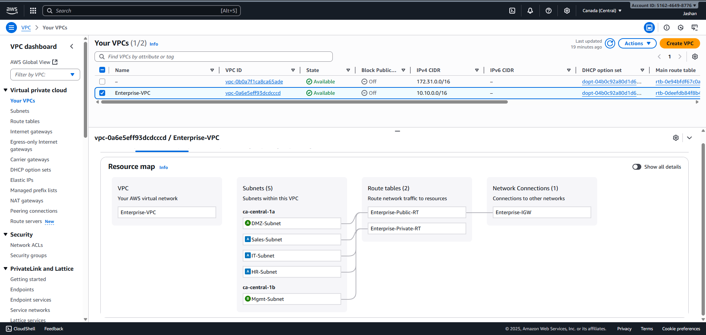

## 📋 Project Overview

Enterprise network simulation demonstrating:
- **5 Segmented Subnets** (Management, IT, Sales, HR, DMZ)
- **Multi-layer Security** (Security Groups + NACLs)
- **Bastion Host Architecture**
- **Department-level Isolation**

## 🏗️ Network Architecture

**VPC:** 10.10.0.0/16

| Subnet | CIDR | Type | Purpose |
|--------|------|------|---------|
| Management | 10.10.0.0/27 | Public | Bastion, NAT Gateway |
| IT | 10.10.0.64/26 | Private | DNS, AD, File Server |
| Sales | 10.10.0.128/26 | Private | CRM, Applications |
| HR | 10.10.0.192/26 | Private | Payroll, HR Portal |
| DMZ | 10.10.1.0/26 | Public | Web Server |

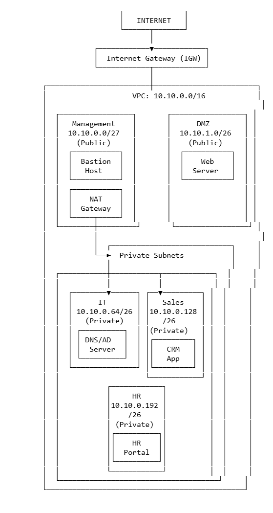

# 🖥️ AWS EC2 Instances Setup

As part of this project, three EC2 instances were created in the AWS console to simulate a segmented network environment. Each instance serves a different purpose and resides in a designated subnet.

### Instances Overview

| Instance Name | Purpose | Network Zone | Description |
|----------------|----------|---------------|--------------|
| **mgmt** | Management Server | Management Subnet | Used for administrative access and centralized management of other instances. |
| **dmz** | Web/DMZ Server | DMZ Subnet | Exposed to the internet to host public-facing applications or web services. |
| **hr** | Internal Application Server | Internal Subnet | Hosts HR or internal business applications not directly accessible from the internet. |

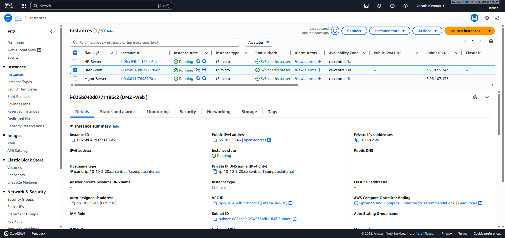
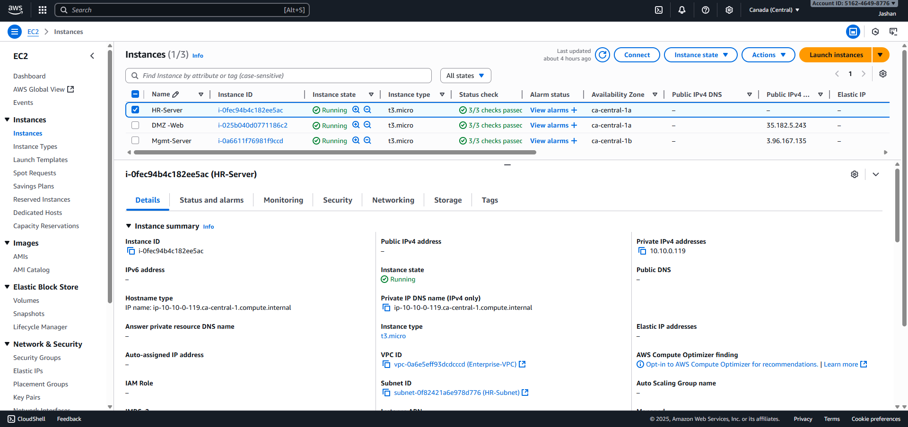
## 🔒 Security Implementation

## Security Groups

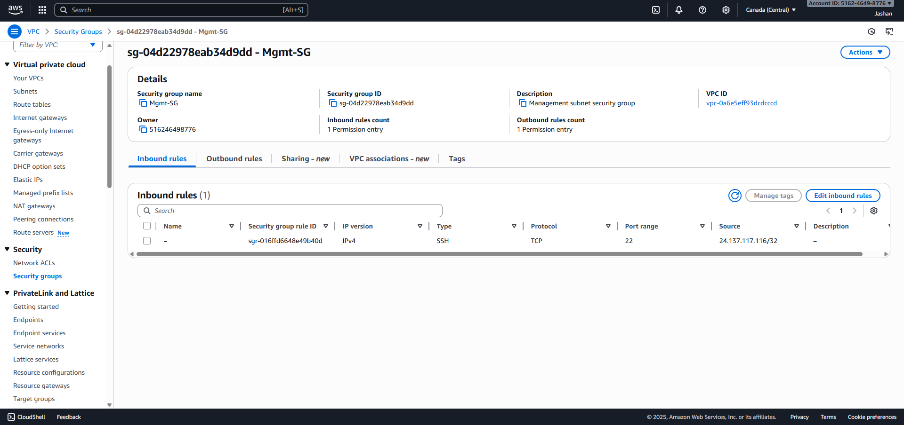
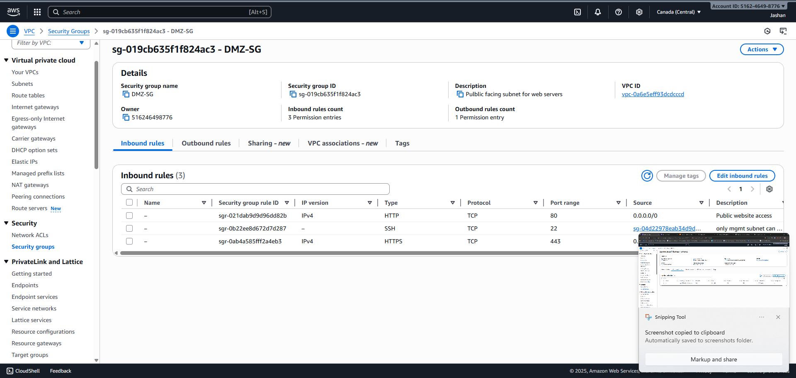

  Internal-SG [HR,IT,Sales]
  
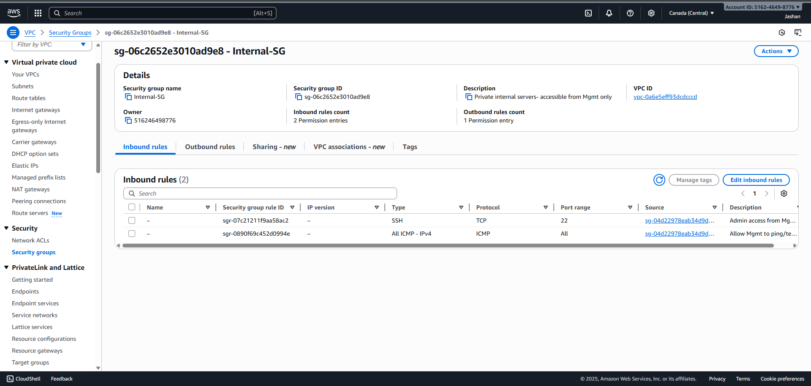

## 🚦 Routing Configuration

**Public Route Table** (Management & DMZ):
- 10.10.0.0/16 → local
- 0.0.0.0/0 → Internet Gateway

**Private Route Table** (IT, Sales, HR):
- 10.10.0.0/16 → local
- 0.0.0.0/0 → NAT Gateway

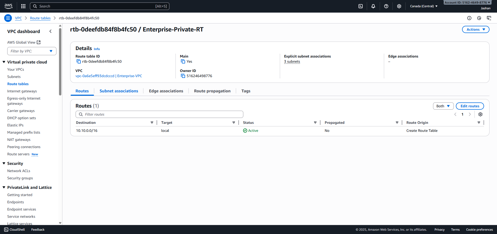
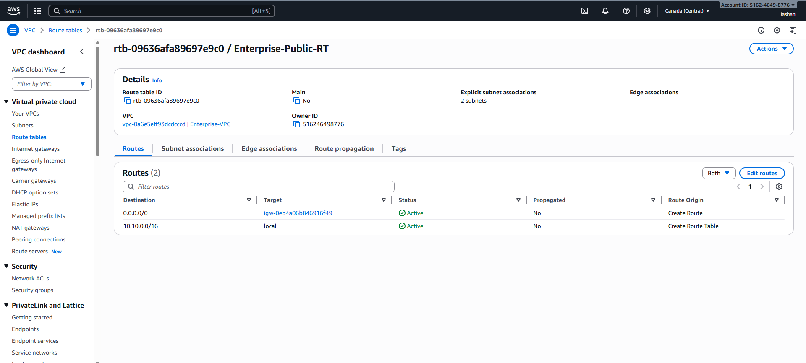

### Test Evidence
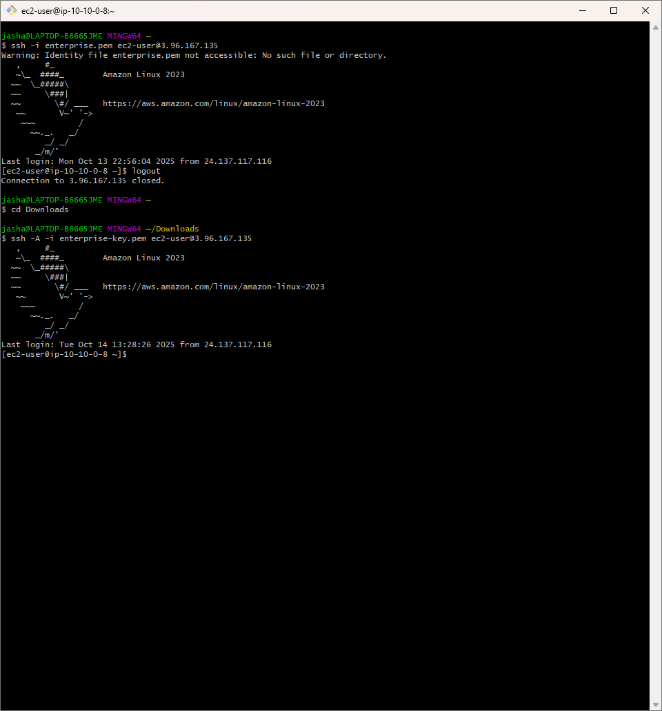
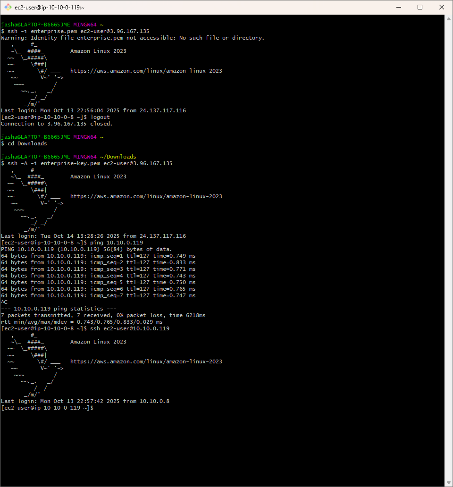
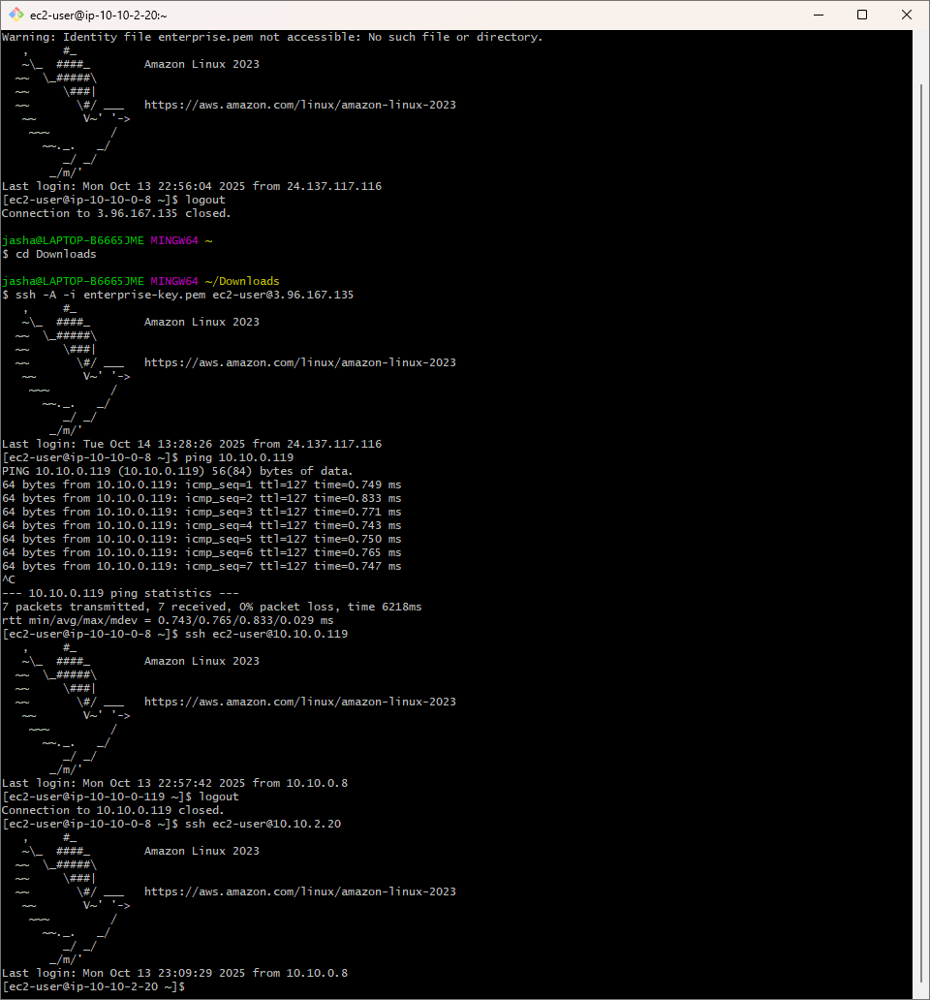

## 🌐 Web Application Deployment

### Apache Web Server in DMZ

A functional web server was deployed in the DMZ subnet to demonstrate public-facing infrastructure:
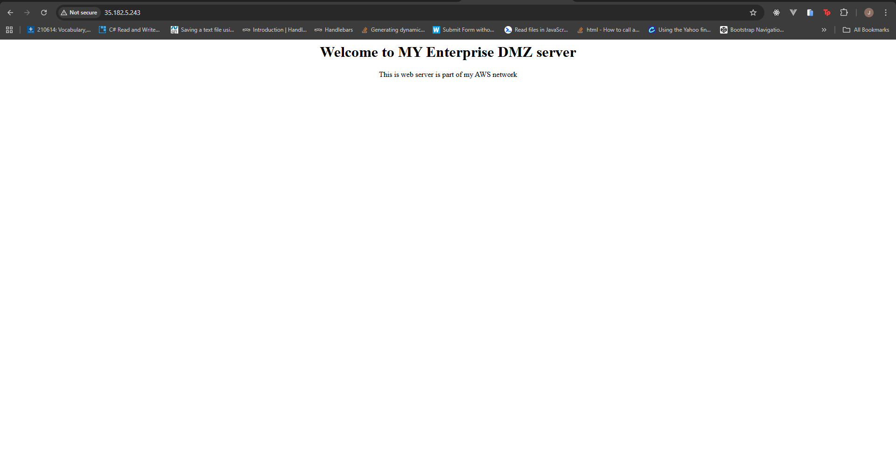

## 🎯 Key Achievements

✅ Enterprise-grade VPC with proper CIDR allocation  
✅ Multi-layer security (Security Groups + NACLs)  
✅ Department isolation preventing lateral movement  
  

## 🛠️ Technologies Used

- AWS VPC, EC2, Internet Gateway, NAT Gateway
- Security Groups & Network ACLs
- Amazon Linux 2
- SSH/SCP for secure access

## 🚀 Future Enhancements

- [ ] Grafana monitoring dashboards
- [ ] VPC Flow Logs integration
- [ ] Application Load Balancer
- [ ] Auto Scaling Groups
- [ ] CloudWatch alarms
